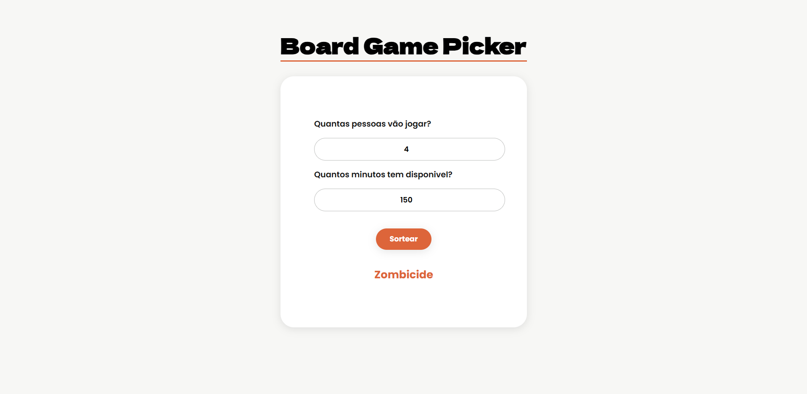

# Board Game Picker

Board Game Picker é uma aplicação web que sugere qual jogo de tabuleiro jogar com base no número de jogadores e no tempo disponível.

[Acesse o projeto](https://tamiresborota.github.io/boardGamePicker/)

## Como usar

1. Informe quantas pessoas vão jogar
2. Informe quantos minutos tem disponível
3. Clique em **Sortear**
4. O jogo sugerido aparecerá na tela

## Tecnologias

- HTML
- CSS
- JavaScript

## O que aprendi desenvolvendo esse projeto

Durante o desenvolvimento pratiquei:

- Modelagem de dados com objetos e arrays
- Criação e encadeamento de funções
- Manipulação do DOM para conectar JavaScript com HTML
- Tratamento de casos de erro, como quando nenhum jogo é encontrado
- Estilização com CSS, incluindo variáveis, flexbox e box-shadow
- Eventos de teclado com `addEventListener('keydown')`
- Feedback visual com `opacity` e `setTimeout`

## Sobre

Projeto desenvolvido como parte da minha transição de carreira para desenvolvimento front-end.